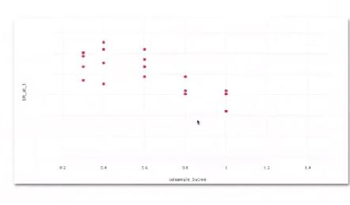
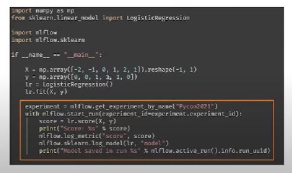
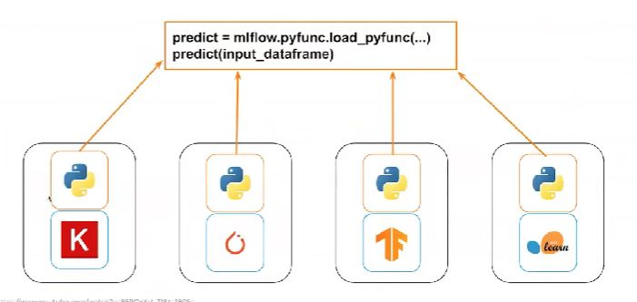
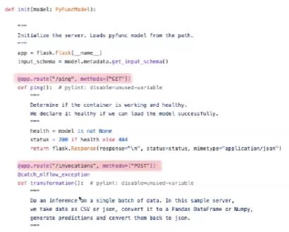
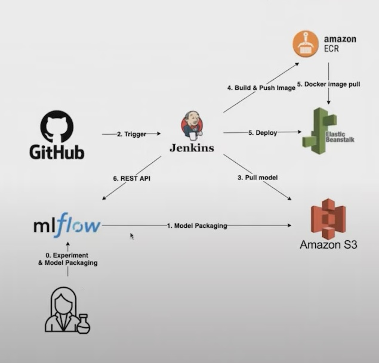

## 1. 머신러닝 프로젝트의 어려움

1. 각 실험을 체계적으로 파악하고 관리하기 어려움

- 어떤 데이터를 이용해서 학습을 진행했었는지 
- 모델에서 사용된 Feature는 어떤 것인지
- 어떤 Parameter를 사용해서 학습을 진행했는지
- 실험 결과가 저장된 곳은 어디인지
- 학습된 모델의 버전은 어떻게 관리할지
- 학습에 사용된 코드는 어떤 버전인지

2. 모델을 배포하는 것에 난이도가 있음

- 사용하는 프레임워크가 연구자마다 상이한데, 배포는 어떤 방식으로 진행할지
- 배포된 모델의 버전관리는 어떻게할지

## 2. MLflow

1. Tracking - 실험에서 사용된 코드, parameter, metric 등 실험에서 생산되는 모든 결과를 기록하고 조회할 수 있음. Python, REST, R, JAVA APIs를 제공

2. Project - 어떤 플랫폼에서도 실험을 재현 가능하도록 패키징 하는 방법을 제공

3. Models - 머신러닝 모델을 패키징하고 서빙할 수 있는 표준화된 방법을 제안

## 3. MLflow Tracking

1. Parameters: Key-value inputs to your code
2. Metric: numeric values that can update over time
3. Artifacts: files, including data and models
4. Tags and Notes: any additional information

## 4. MLflow Tracking - Metric

- Accuracy / Loss 등 임의의 Metric을 실험마다 기록해둘 수 있음
- 이는 진행된 실험 간 비교를 할 때 유용하게 사용할 수 있음

## 5. MLflow Tracking - Tags

- 각 실험에 임의의 Tag를 달아둘 수 있음

- Search Runs 기능을 통하여 tag를 이용하여 실험에 필터를 걸어서 원하는 실험을 찾아볼 수 있음

- 완료된 실험들의 결과를 해석할 때 유용하게 사용할 수 있음

## 6. MLflow Tracking - Metric & Parameter

- Tag를 통하여 실험을 필터링하여, Parameter와 Metric의 상관관게를 분석할 수 있음

- 예시는 Accuracy와 XGBoost의 parameter인 colsample_bytree간의 상관관계를 보여줌

- colsample_by_tree가 낮을수록 더 높은 정확도를 보임을 확인할 수 있음

## 7. MLflow Tracking - Artifacts

- 실험에 사용된 임의의 파일을 업로드하여 관리할 수 있음

## 8. MLflow Models

## 9. MLflow Models - Flavor

## 10. Serving with MLflow

- mlflow models는 build-docker 기능을 제공

- build-docker 명령어는 Flask 기반의 웹 서버를 이미지화함

- /ping과 /invocations 두 종류의 endpoint를 제공하며 /invocations을 통하여 mlflow에 저장된 모델의 추론 결과를 반환받을 수 있음

- Flask Application은 gunicorn과 nginx를 앞단에 감싸줌으로써 효과적으로 cpu를 사용

- 즉, build-docker명령어는 Flask + gunicorn + nginx 기반의 웹 서버를 이미지화하며, 추가적인 gunicorn 설정을 넣어줄 수 있음

## 11. 회사에서 활용 사례

- 많은 ML 엔지니어의 백그라운드가 SW에 있지 않기 때문에 앞선 Iteration에 있어 병목이 발생

- ML엔지니어의 가장 큰 병목인 배포과정을 MLFlow를 통하여 자동하하여 배포의 난이도를 낮춰 ML 프로덕트 개발 속도를 증진하고자 하는 목적이 있었음

- MLflow에서 제공하는 Model Packaging 기능을 활요ㅕㅇ하여 배포의 난이도를 낮추고자 함
